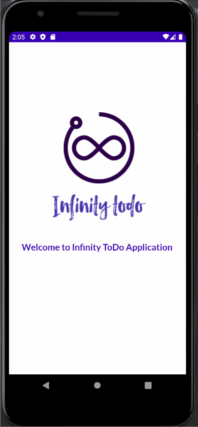

<h1>Infinity To-Do Application - Readme File</h1>

<h2>Infinity ToDo Application</h2>

A simple To Do List Application designed to maximize productivity for bigger problems. It’s a minimal to do list, checklist and task manager application which will perhaps help you to get your tasks done. The primary goal of the application is to add value to your life by helping you organize your upcoming tasks. Hope you will enjoy using the application. Regards, Infinity To-Do! 

Developer’s Info: The application has been designed and developed by Avhimanhu Sapkota (Leeds Beckett ID: 77202323). This application is an assessment of a module Developing Mobile Application (DMA). It is a curriculum of Level 6 of Bachelor in Computing honors affiliated to Leeds Beckett University.  
The application’s source code and all the necessary raw documents can be found on the following git link: https://github.com/Avhimanhu-Sapkota/DMA_Infinity_ToDo_Application

<h2>User Guidelines</h2>
As mentioned earlier, Infinity ToDo is a minimal yet productive application to handle tasks in an organized manner. Thus, we believe in ‘Less is More’ philosophy of Minimalism. Therefore, the application has minimal features which will help you to get things done. Some features of the application have been mentioned below.

<h3>Login Information</h3>
The first page you will encounter in the application is the Login Page. The application is designed to be used by a single user however privacy matters. Thus, login page has been added on the application.  
The login credentials for the initial login have been set to default: 
<b>Username: admin
Password: password </b> 
Once you have logged in into the application, you will not be asked to login again when you open the app, until and unless you log out manually. 

<h3>Home Page</h3>
The successful login into the application will transfer you to the home page of the application. This page will list all the tasks you have added in the application. In order to give a simple introduction overview, a default task will be displayed. This task will remain in the screen unless you delete it yourself. The home page of the application is the primary page which contains all the other features of the application. Some features, along with their tutorials, that you will be able to access from the page are:

<h4>Add a To-Do Task</h4>
<ul>
	<li>Press on the purple button on the bottom of the right-hand side of the page.</li>
	<li>A new page will open where you will be asked to enter details of the task.</li>
	<li>Firstly, you are supposed to add the title of your task.</li>
	<li>Add a description of the task (This is an optional feature; you are free to not add a description).</li>
	<li>Select the desired date by which the task is supposed to be completed.</li>
	<li>Select your task priority. The color of the priority will help you to identify the importance and urgency of the task. So, we suggest you to choose the priority wisely.</li>
	<li>7. Finally, to save your to-do task, click on the save button.  
		N.B. you will encounter a problem if you don’t enter title, choose date and priority for the task. As these are the mandatory details, you must enter these details.</li>
	<li>In case you decide to cancel the process. You can press the cancel button to return to the home page of the application.</li>
</ul>
<h4>Edit a To-Do Task</h4>
<ul>
	<li>Press on the desired task to edit the task.</li>
	<li>The form page with your task’s details will appear. Make your desired changes.</li>
	<li>If you have completed the task. Do check on the ‘Task Status’ checkbox.</li>
	<li>Click on the Update button to update the task details.</li>
	<li>Click on the cancel button to discard the edits you have made.</li>
</ul>
<h4>Update a To-Do Task as completed</h4>
<ul>
	<li>Press on the task and swipe the task from left towards right to update a task as completed.</li>
	<li>Or, press on the desired task and check the ‘Task Status’ checkbox in the Update Screen.</li>
</ul>
<h4>Delete a To-Do Task</h4>
	<ul><li>Press on the task and swipe the task from right to left to delete the task. </li></ul>

<h4>Delete Completed To-Do Tasks</h4>
<ul>
	<li>Click on the three dots, on the top right-hand side of your home page.</li>
	<li>You will be displayed with options, choose Delete Completed to delete all the completed tasks.</li>
</ul>
<h4>Delete All To-Do Tasks</h4>
<ul>
	<li>Click on the three dots, on the top right-hand side of your home page.</li>
	<li>You will be displayed with options, choose Delete All to delete all the tasks added in the application.</li>
</ul>
<h4>Log Out</h4>
<ul>
	<li>Click on the three dots, on the top right-hand side of your home page.</li>
	<li>You will be displayed with options, choose Logout to log out of the application.</li>
	<li>You will be re-directed to the login page of the application.</li>
</ul>

 
<h3>Final Notes</h3>
The application has been demonstrated on the video above, hope it will be helpful to learn to use Infinity ToDo.I hope that Infinity ToDo will add value to your life. Thanks for using the application, I hope you will love it. Thank You! Lots of Love!
